# Mini-Agent: 轻量化智能体框架

> 受 [AgentScope](https://github.com/modelscope/agentscope) 启发的极简智能体框架  
> 集成 ReAct、增强推理、A-MEM 记忆系统等先进技术

[](https://www.python.org/downloads/)
[](LICENSE)
[](https://github.com/psf/black)

## ✨ 核心特性

- 🎯 **极简设计** - 无冗余注释，清晰命名，核心代码仅 12 个模块
- ⚡ **异步优先** - 全异步 I/O，并发工具调用，流式输出
- 🔄 **自动容错** - ChaterPool/EmbedderPool 自动故障转移
- 🎨 **策略模式** - Speaker 输出策略，Hook 装饰器系统
- 🛠️ **MCP 集成** - 原生支持 Model Context Protocol
- 🧠 **A-MEM 记忆** - 基于论文 [arXiv:2502.12110](https://arxiv.org/abs/2502.12110) 的自进化记忆系统
- 🤖 **ReAct 框架** - 完整的推理-行动循环
- 🌐 **多模态** - 图片、音频、视频内容支持
- 📊 **向量检索** - 内置 ChromaDB/JSON 向量存储


## 🚀 快速开始 Quick Start

安装后，您可以直接导入模块，无需相对路径导入：

```python
# 导入核心模块
from core import Agent, Memory, ChaterPool, get_chater_cfg, ToolKit

# 导入 Prompt 模板
from prompt import REACT_PROMPTS, build_classic_react_system_prompt

# 创建智能体
agent = Agent(
    name="MyAgent",
    chater=ChaterPool([get_chater_cfg("siliconflow")]),
    memory=Memory(max_messages=20),
    system_prompt="You are a helpful assistant."
)

# 使用智能体
async for response in agent.reply("Hello!"):
    print(response.content)
```

## 📐 系统架构

### 核心架构层次

```mermaid
graph TB
    subgraph "应用层 Application"
        ReActAgent[ReActAgent<br/>ReAct推理]
        PlanReAct[PlanReActAgent<br/>计划-执行]
        Reflection[ReflectionAgent<br/>反思优化]
        SelfConsist[SelfConsistencyAgent<br/>自洽性验证]
        AgenticMem[AgenticMemoryAgent<br/>A-MEM记忆系统]
    end
    
    subgraph "核心层 Core"
        direction TB
        Agent[Agent 基础智能体]
        BaseAgent[BaseAgent 抽象基类]
        
        Agent -->|继承| BaseAgent
    end
    
    subgraph "模型层 Model"
        direction LR
        ChaterPool[ChaterPool<br/>故障转移池]
        Chater1[Chater 1]
        Chater2[Chater 2]
        ChaterN[Chater N]
        
        EmbedderPool[EmbedderPool<br/>嵌入模型池]
        Embedder1[Embedder 1]
        Embedder2[Embedder 2]
        
        ChaterPool -->|自动切换| Chater1
        ChaterPool -->|失败重试| Chater2
        ChaterPool -.->|备用| ChaterN
        
        EmbedderPool --> Embedder1
        EmbedderPool --> Embedder2
    end
    
    subgraph "工具层 Tools"
        ToolKit[ToolKit 工具箱]
        NativeTools[原生Python函数]
        MCPTools[MCP Protocol工具]
        
        ToolKit --> NativeTools
        ToolKit --> MCPTools
    end
    
    subgraph "存储层 Storage"
        Memory[Memory<br/>对话记忆]
        VectorStore[VectorStore<br/>向量检索]
        ChromaDB[ChromaDB]
        JsonStore[JsonVectorStore]
        
        VectorStore --> ChromaDB
        VectorStore --> JsonStore
    end
    
    subgraph "通信层 Communication"
        MsgHub[MsgHub<br/>消息广播中心]
        SeqPipe[Sequential<br/>串行流水线]
        ParaPipe[Parallel<br/>并行流水线]
        CondPipe[Conditional<br/>条件流水线]
        LoopPipe[Loop<br/>循环流水线]
    end
    
    subgraph "输出层 Output"
        Speaker[Speaker 抽象]
        Console[ConsoleSpeaker]
        Silent[SilentSpeaker]
        Custom[CustomSpeaker]
        
        Speaker --> Console
        Speaker --> Silent
        Speaker --> Custom
    end
    
    subgraph "Hook系统 AOP"
        PreReply[pre_reply]
        PostReply[post_reply]
        PreObserve[pre_observe]
        PostObserve[post_observe]
    end
    
    ReActAgent -->|继承| Agent
    PlanReAct -->|继承| Agent
    Reflection -->|继承| Agent
    SelfConsist -->|继承| Agent
    AgenticMem -->|继承| Agent
    
    Agent --> ChaterPool
    Agent --> Memory
    Agent --> ToolKit
    Agent --> Speaker
    
    AgenticMem --> EmbedderPool
    AgenticMem --> VectorStore
    
    Agent -.装饰.-> PreReply
    Agent -.装饰.-> PostReply
    Agent -.装饰.-> PreObserve
    Agent -.装饰.-> PostObserve
    
    MsgHub -.广播.-> Agent
    SeqPipe -.编排.-> Agent
    ParaPipe -.编排.-> Agent
    CondPipe -.编排.-> Agent
    LoopPipe -.编排.-> Agent
    
    style AgenticMem fill:#ff9999
    style ChaterPool fill:#99ccff
    style MsgHub fill:#99ff99
    style VectorStore fill:#ffcc99
```



## 🔄 Agent 执行流程

**核心执行步骤：**

1. **接收输入** → pre_reply hooks 预处理
2. **存入记忆** → Memory 添加用户消息  
3. **ReAct 循环**（最多 max_iterations 次）：
   - 构建对话历史
   - ChaterPool 调用 LLM（自动故障转移）
   - **如有工具调用**：并发执行工具 → 存储结果 → 继续循环
   - **如是最终答案**：post_reply hooks → Speaker 输出 → 结束
4. **返回响应** → 异步生成器或完整响应

**AgenticMemoryAgent 额外流程：**
- 向量检索相似记忆
- LLM 分析决策是否进化
- 更新记忆连接和标签
- 存储新的向量嵌入


## 🎯 核心组件详解

### 1. Agent 智能体系统

#### Hook 装饰器系统

```python
@agent.pre_reply
def preprocess(message):
    return message.lower()

@agent.post_reply
def postprocess(response):
    response.content = f"✨ {response.content}"
    return response
```

**Hook 类型：**
- `@agent.pre_reply` / `@agent.post_reply` - 拦截回复，修改输入/输出
- `@agent.pre_observe` / `@agent.post_observe` - 拦截观察，增强记忆
- `@agent.pre_speak` / `@agent.post_speak` - 拦截输出，自定义格式
- `@BaseAgent.pre_reply` - 类级别 Hook，影响所有 Agent 实例

**Speaker 策略：** ConsoleSpeaker/SilentSpeaker，自定义输出格式

### 2. 模型层

**ChaterPool 自动故障转移：** 主模型失败自动切换备用，实现断路器模式

**多模态支持：** 图片、音频、视频内容（base64/URL）

### 3. 工具系统

**ToolKit：** 注册 Python 函数或 MCP 协议工具

**特性：** 并发执行、超时控制、错误隔离、MCP 集成

### 4. 通信与编排

**MsgHub：** 多智能体自动广播通信

**Pipeline：** 4 种模式 - Sequential/Parallel/Conditional/Loop

### 5. A-MEM 自进化记忆系统

**论文参考:** [A-MEM: Agentic Memory for LLM Agents (arXiv:2502.12110)](https://arxiv.org/abs/2502.12110)

智能体驱动的记忆系统，具有自主分析、组织和进化能力：

```python
from agent import AgenticMemoryAgent

agent = AgenticMemoryAgent(
    name="MemoryAgent",
    chater=ChaterPool([get_chater_cfg("zhipuai")]),
    embedder=EmbedderPool([get_embedder_cfg("zhipuai")]),
    memory=Memory(),
    evo_threshold=100  # 每100次交互触发进化
)

await agent.add_memory("Python是一门高效的编程语言")
results = await agent.retrieve_memories("编程语言", k=5)
```

**核心特性：**
- LLM 自动提取 keywords、context、tags
- 基于语义相似性建立记忆图结构
- 记忆节点自主进化和更新
- 多维混合检索（内容+关键词+标签）


## 🎨 设计模式

- **策略模式** (Speaker): 输出格式化独立可替换
- **装饰器模式** (Hooks): AOP 实现，无需元类
- **池化模式** (ChaterPool): 自动故障转移
- **观察者模式** (MsgHub): 多智能体广播


## ⚡ 性能特性与优化

### 异步优先设计
- **全异步 I/O**：所有 LLM 调用、工具执行、向量检索均为异步
- **并发工具调用**：使用 `asyncio.gather` 并行执行多个工具
- **流式输出**：支持 SSE 流式响应，实时显示生成内容
- **非阻塞**：Speaker 和 Hook 系统不阻塞主流程

### 容错与可靠性
- **ChaterPool 故障转移**：主模型失败自动切换备用模型
- **断路器模式**：记录失败次数，暂时跳过故障模型
- **重试机制**：Tenacity 库实现指数退避重试
- **错误隔离**：工具执行失败返回错误信息而非崩溃

### 内存与存储
- **轻量级 Memory**：仅保留最近 N 条消息
- **向量存储缓存**：ChromaDB 持久化，避免重复嵌入
- **懒加载**：MCP 服务器按需连接
- **流式处理**：大文件分块读取，不全量加载

### 代码优化
- **无冗余注释**：清晰命名代替注释，减少维护成本
- **模块化设计**：单一职责，易于测试和替换
- **类型提示**：全面使用 Python 类型提示
- **极简原则**：核心代码仅 12 个模块，总计约 6000 行

## 🎯 设计原则

**单一职责** · **开闭原则** · **依赖倒置** · **组合优于继承** · **极简主义**

## 🙏 致谢

受 [AgentScope](https://github.com/modelscope/agentscope) 启发，采用装饰器 Hook、消息中心等设计，优化为异步优先、极简轻量。

## 📄 许可证

MIT License

## 🤝 贡献指南

欢迎贡献代码、报告问题或提出建议！

### 开发规范
1. **无注释原则**：使用清晰的命名代替注释，代码即文档
2. **极简主义**：保持核心功能简洁，避免过度设计
3. **类型提示**：所有公共 API 必须包含类型提示
4. **异步优先**：新功能优先使用异步实现
5. **示例驱动**：为新功能添加独立可运行的示例
