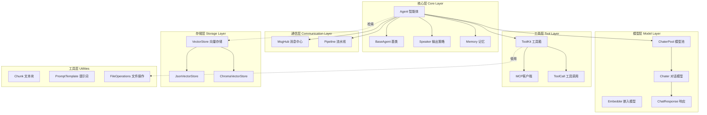
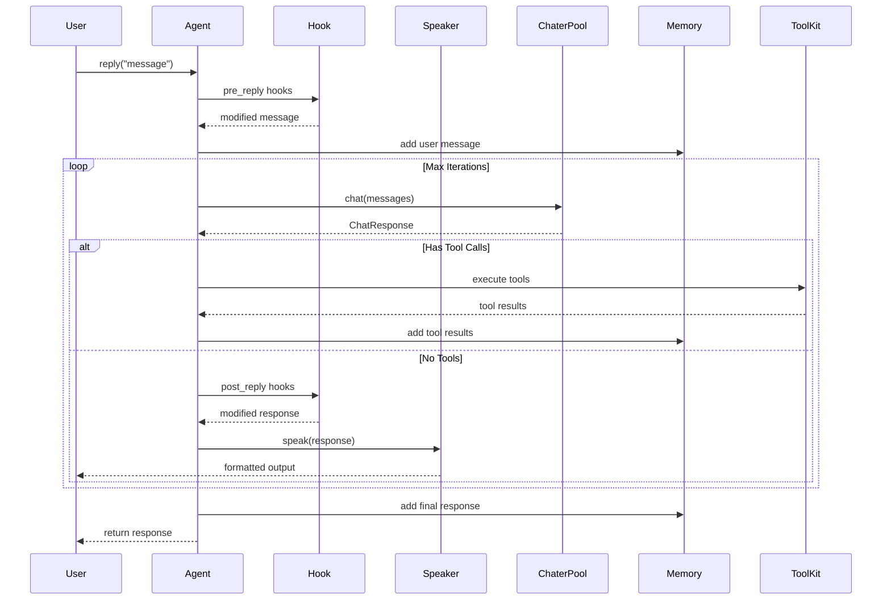
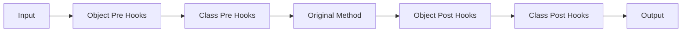
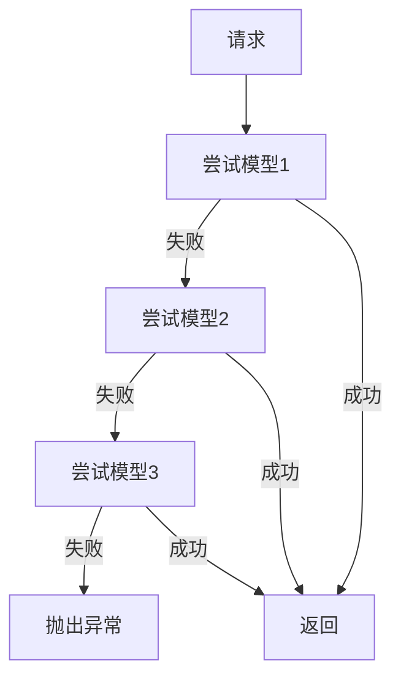
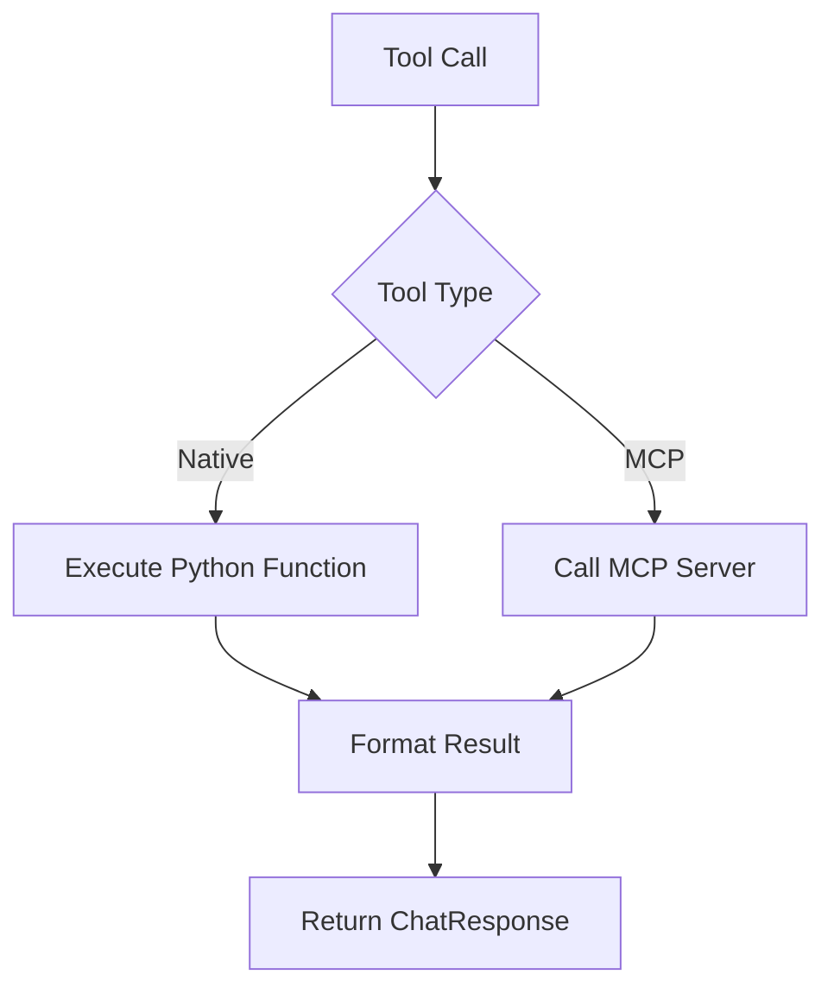
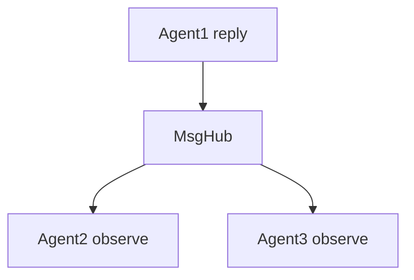

# 轻量化多智能体框架

> 受 [AgentScope](https://github.com/modelscope/agentscope) 启发的极简智能体框架，专注于性能和可扩展性

## 📐 系统架构



## 🏗️ 数据流架构



## 🎯 核心组件详解

### 1. Agent 智能体系统

#### Hook 装饰器系统

```python
@agent.pre_reply
def preprocess(message):
    return message.lower()

@agent.post_reply
def postprocess(response):
    response.content = f"✨ {response.content}"
    return response
```

**Hook 执行流程：**


**Hook 类型：**
- `pre_reply` / `post_reply` - 拦截回复
- `pre_observe` / `post_observe` - 拦截观察
- `pre_speak` / `post_speak` - 拦截输出

#### Speaker 策略模式

```python
class CustomSpeaker(Speaker):
    def speak_stream_start(self, agent_name: str):
        print(f"🤖 {agent_name}: ", end="", flush=True)
    
    def speak_chunk(self, chunk: ChatResponse):
        print(chunk.content, end="", flush=True)
    
    def speak_stream_end(self):
        print(" ✨")
    
    def speak_complete(self, response: ChatResponse, agent_name: str):
        print(f"🤖 {agent_name}: {response.content}")
```

### 2. 模型层架构

#### ChaterPool 自动故障转移

```python
pool = ChaterPool([
    get_chater_cfg("siliconflow"),
    get_chater_cfg("zhipuai"),
    get_chater_cfg("openai")
])
```

**工作原理：**


#### 多模态内容支持

```python
content = MultimodalContent()
content.add_text("Describe this image:")
content.add_image(url="https://example.com/image.jpg")
content.add_audio(base64="...")
```

### 3. 工具系统

#### 原生函数注册

```python
toolkit = ToolKit()

async def get_weather(city: str) -> str:
    return f"{city} is sunny"

toolkit.register(get_weather, "get_weather")
```

#### MCP (Model Context Protocol) 集成

```python
from core._tools import MCPServerConfig

mcp_config = MCPServerConfig(
    name="filesystem",
    command="npx",
    args=["-y", "@modelcontextprotocol/server-filesystem", "/path/to/dir"]
)

toolkit.add_mcp_server(mcp_config)
await toolkit.connect_mcp_servers()
```

**工具执行流程：**


### 4. 通信与编排

#### MsgHub 消息中心

```python
with msghub([agent1, agent2, agent3]):
    agent1.reply("Hello")
```

**广播机制：**


#### Pipeline 流水线

**串行流水线：**
```python
result = await sequential_pipeline([agent1, agent2, agent3], initial_message)
```

**并行流水线：**
```python
results = await parallel_pipeline([agent1, agent2, agent3], message)
```

**条件流水线：**
```python
result = await conditional_pipeline(
    condition=lambda msg: "urgent" in msg.content,
    true_agent=urgent_handler,
    false_agent=normal_handler,
    message=message
)
```

**循环流水线：**
```python
result = await loop_pipeline(
    agents=[analyzer, refiner],
    initial_message=message,
    max_iterations=5,
    stop_condition=lambda msg: "DONE" in msg.content
)
```

### 5. 向量存储与检索

```python
from core import JsonVectorStore, Embedder

store = JsonVectorStore(persist_path="./vectors")
embedder = Embedder(...)

embeddings = await embedder.embed(["text1", "text2"])
await store.add(
    ids=["id1", "id2"],
    texts=["text1", "text2"],
    embeddings=embeddings
)

query_emb = await embedder.embed(["query"])
results = await store.search(query_emb[0], k=5)
```

### 6. 提示词模板

```python
from core import PromptTemplate

template = PromptTemplate("Hello {name}, you are {age} years old")

result = template.format(name="Alice", age=25)
print(result.totext())

prompt1 = PromptTemplate("Task: {task}")
prompt2 = PromptTemplate("Context: {context}")
combined = prompt1 + prompt2
```

## 🚀 快速开始

### 基础智能体

```python
import asyncio
from core import Agent, ChaterPool, Memory, get_chater_cfg

async def main():
    agent = Agent(
        name="Assistant",
        chater=ChaterPool([get_chater_cfg("siliconflow")]),
        memory=Memory(),
        system_prompt="You are a helpful assistant."
    )
    
    async for response in agent.reply("Hello!", stream=True):
        agent.speak(response, stream=True)

asyncio.run(main())
```

### 带工具的智能体

```python
from core import ToolKit
from datetime import datetime

async def get_time() -> str:
    return datetime.now().strftime("%Y-%m-%d %H:%M:%S")

toolkit = ToolKit()
toolkit.register(get_time, "get_time")

agent = Agent(
    name="TimeAgent",
    chater=ChaterPool([get_chater_cfg("siliconflow")]),
    memory=Memory(),
    tools=toolkit
)

async for response in agent.reply("What time is it?"):
    print(response.content)
```

### 多智能体协作

```python
from core import msghub

agent1 = Agent(name="Analyzer", ...)
agent2 = Agent(name="Executor", ...)
agent3 = Agent(name="Reviewer", ...)

with msghub([agent1, agent2, agent3]):
    async for r in agent1.reply("Analyze this task"):
        agent1.speak(r)
    
    async for r in agent2.reply("Execute the plan"):
        agent2.speak(r)
```

## 📦 完整示例

查看 `examples/` 目录：

- `01_single_agent_with_tools.py` - 基础智能体与工具调用
- `02_hooks_demo.py` - Hook 装饰器演示
- `03_multi_agent_msghub.py` - 多智能体通信
- `07_decorator_hooks_final.py` - 完整 Hook 系统
- `08_custom_speaker.py` - 自定义 Speaker 实现

## 🎨 设计模式

### 策略模式 (Speaker)

输出格式化逻辑独立，易于替换和测试。

### 装饰器模式 (Hooks)

无需元类，使用装饰器实现 AOP，性能更好。

### 池化模式 (ChaterPool, EmbedderPool)

自动故障转移，提高系统可靠性。

### 观察者模式 (MsgHub)

多智能体自动广播通信。

## ⚙️ 配置

```bash
export SILICONFLOW_API_KEY="your-key"
export ZHIPUAI_API_KEY="your-key"
export OPENAI_API_KEY="your-key"
```

## 🔧 核心模块详解

| 模块 | 功能 | 文件大小 |
|------|------|---------|
| `_agent.py` | 智能体核心，Hook系统 | 19KB |
| `_model.py` | 模型封装，响应结构 | 38KB |
| `_tools.py` | 工具系统，MCP集成 | 25KB |
| `_speaker.py` | 输出策略 | 1.6KB |
| `_msghub.py` | 消息中心 | 2KB |
| `_pipeline.py` | 流水线编排 | 3KB |
| `_prompt.py` | 提示词模板 | 6KB |
| `_chunk.py` | 文本分块 | 33KB |
| `_vb.py` | 向量存储 | 19KB |
| `_utils.py` | 工具函数 | 44KB |
| `_exceptions.py` | 异常定义 | 1.5KB |

## 📊 性能特性

- ✅ **异步优先** - 全异步 I/O，高并发
- ✅ **并发工具调用** - `asyncio.gather` 并行执行
- ✅ **流式输出** - 支持 SSE 流式响应
- ✅ **内存高效** - 轻量级数据结构
- ✅ **可扩展** - 清晰的抽象层次

## 🔄 与 AgentScope 的差异

| 特性 | AgentScope | 本框架 |
|------|-----------|--------|
| Hook 实现 | Metaclass | Decorator |
| 输出格式化 | 内置 print | Speaker 策略 |
| 工具系统 | 基础实现 | MCP 协议集成 |
| 流水线 | 无内置 | 4种模式 |
| 向量存储 | 无 | 内置支持 |
| 代码风格 | 功能完整 | 极简轻量 |

## 🎯 设计原则

1. **单一职责** - 每个模块功能独立
2. **开闭原则** - 通过继承扩展，不修改核心
3. **依赖倒置** - 依赖抽象接口
4. **组合优于继承** - Speaker/ToolKit 可组合
5. **极简主义** - 只保留核心功能

## 🙏 致谢

本项目深受阿里巴巴 ModelScope 团队开发的 [AgentScope](https://github.com/modelscope/agentscope) 启发。

采用的设计模式：
- Hook 系统架构（装饰器重新实现）
- 消息中心概念
- 智能体基类结构
- 工具集成模式

优化方向：
- 降低复杂度（装饰器 vs 元类）
- 提升性能（异步优先）
- 简化定制（策略模式）
- 精简代码（极简主义）

## 📄 许可证

MIT License

## 🤝 贡献

欢迎贡献！请遵循：
- 代码无注释（清晰命名）
- 极简设计原则
- 为新功能添加示例
